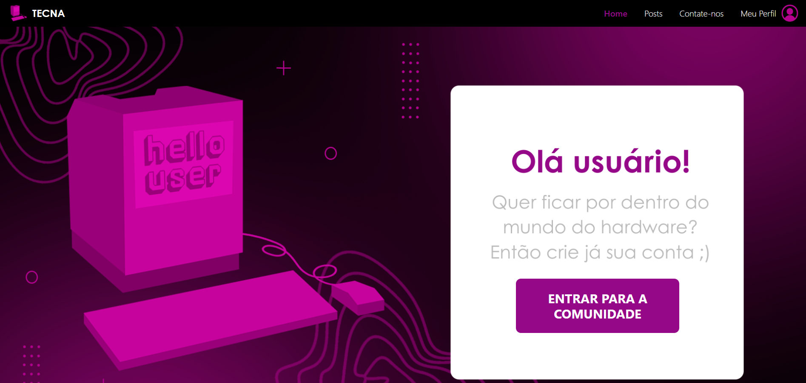

# 🌐 TECNA — Comunidade de Hardware

Plataforma online para compartilhamento de conhecimento sobre hardware de computadores, permitindo que os usuários tirem dúvidas, ajudem outros entusiastas e compartilhem experiências. Desenvolvido em React no frontend e Node.js com MySQL no backend.

O projeto visa criar um espaço interativo e colaborativo, promovendo aprendizado e troca de informações sobre hardware.

---

## ✨ Principais funcionalidades
- 📝 Criar conta de usuário
- 🔑 Login/logout
- 🖊️ Criar posts sobre hardware
- 💬 Comentar em posts de outros usuários
- 👀 Visualizar posts e comentários da comunidade
- ⚙️ Estrutura pensada para fácil expansão e manutenção
- 📦 Integração com MySQL para armazenamento de dados

---

## 📸 Preview
  

---

## 🔧 Como rodar o projeto localmente

# 1. Clone este repositório
git clone https://github.com/seu-usuario/tecna.git

# 2. Acesse a pasta do projeto
cd tecna

# 3. Instale as dependências
npm install

# 4. Crie o banco de dados MySQL
# Certifique-se de ter o MySQL instalado localmente
mysql -u root -p
CREATE DATABASE db_tecna;

# 5. Importe o arquivo SQL do banco de dados
mysql -u root -p db_tecna < db_tecna.sql

# 6. Crie um arquivo .env na raiz do projeto com as credenciais do banco
# Exemplo de .env:
# DB_HOST=localhost
# DB_USER=root
# DB_PASSWORD=
# DB_NAME=db_tecna

# 7. Inicie o servidor
npm start

# 8. Acesse no navegador
http://localhost:3000

